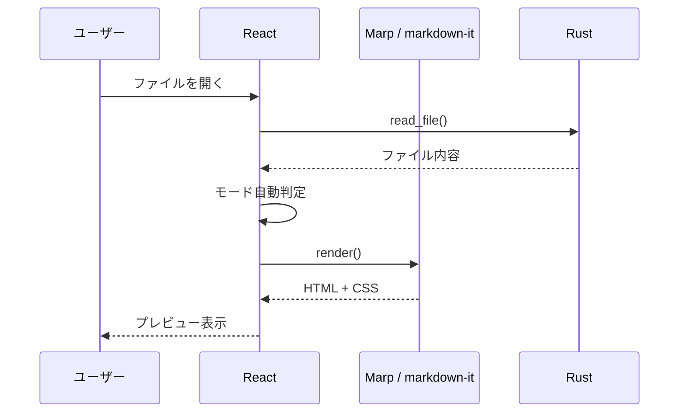
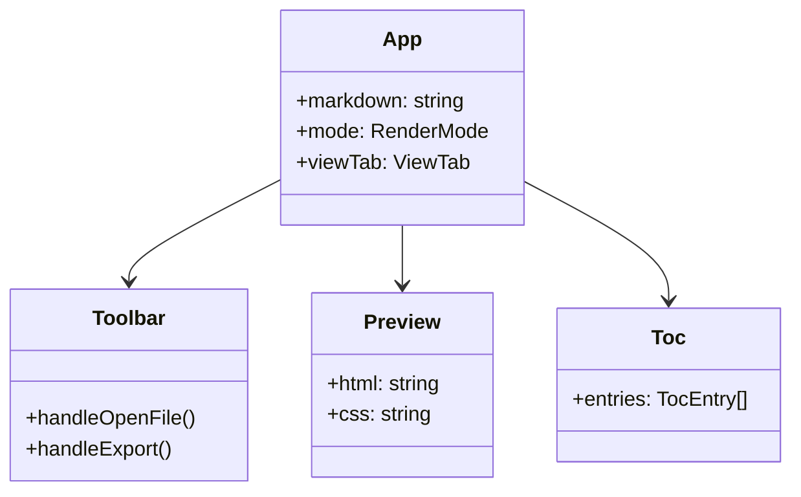
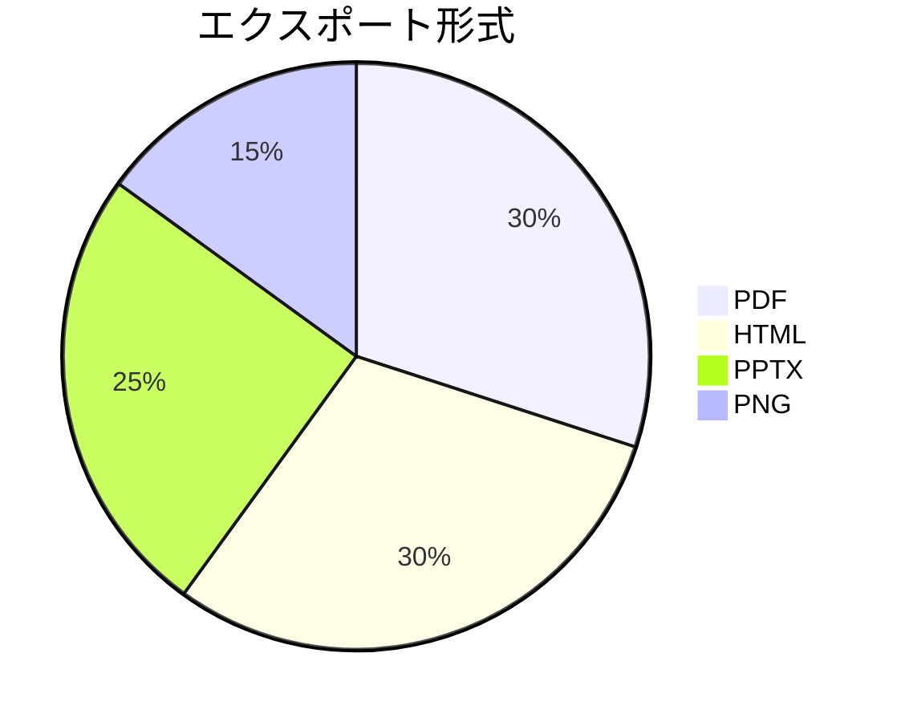

# Markview デモ

Marp スライド + Mermaid ダイアグラムのサンプル

---

## アプリ構成

---

## 処理フロー

---

## コンポーネント構成

---

## 技術スタック

| レイヤー | 技術 |
|---------|------|
| デスクトップ | Tauri v2 |
| フロントエンド | React + TypeScript |
| スライド | Marp Core |
| Markdown | markdown-it |
| ダイアグラム | Mermaid |

---

## 対応エクスポート形式

---

<!-- _class: lead -->

# Thank you!

Markview をお試しください
