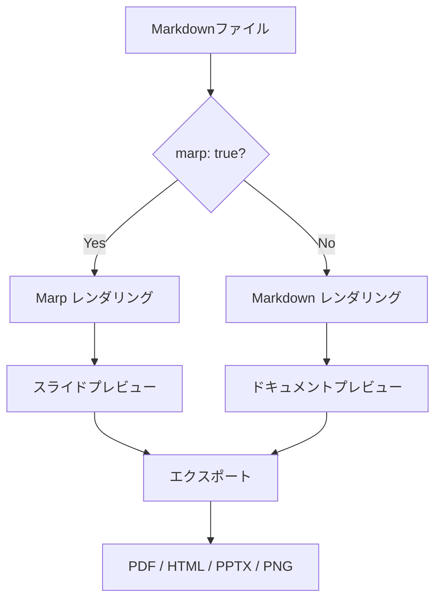
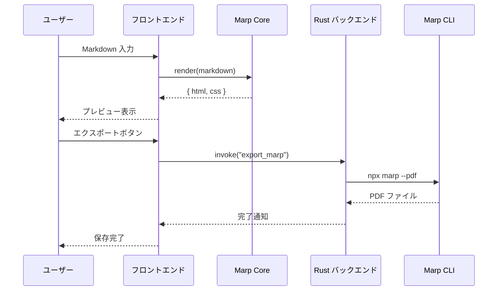
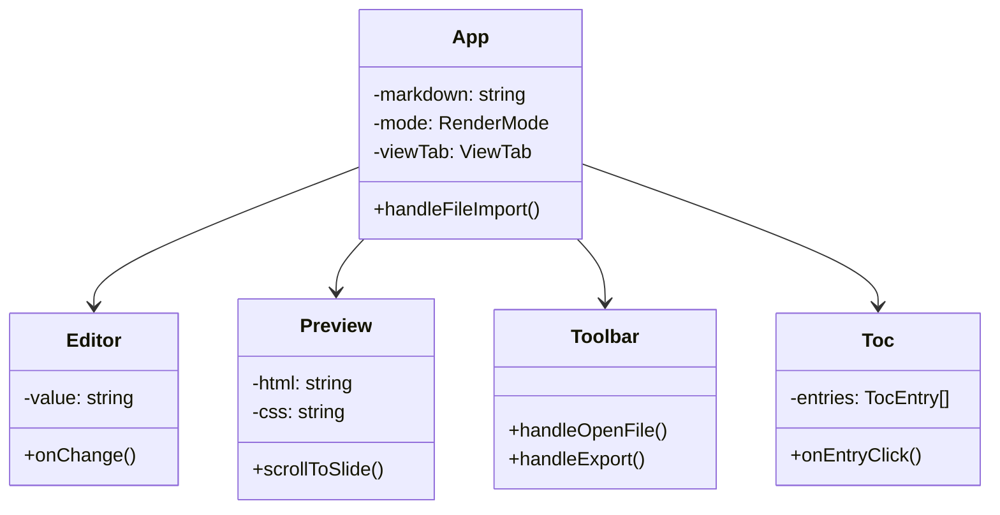
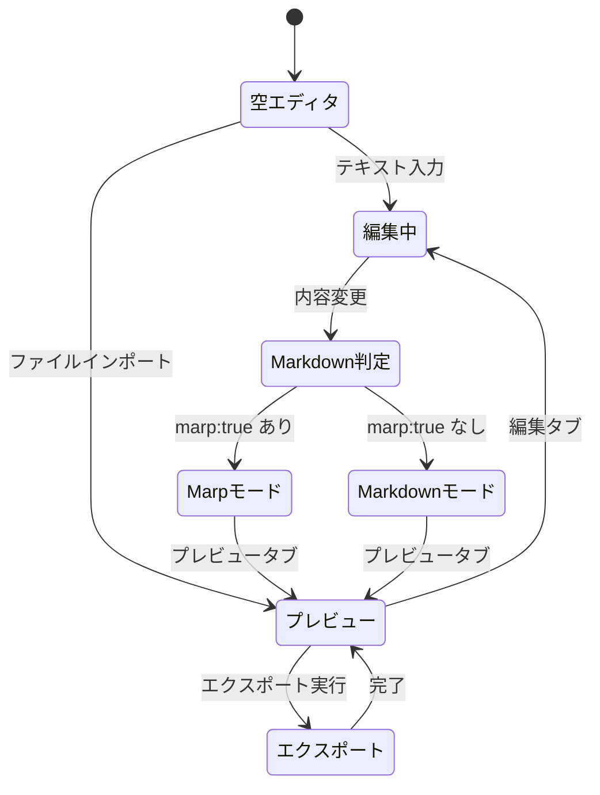
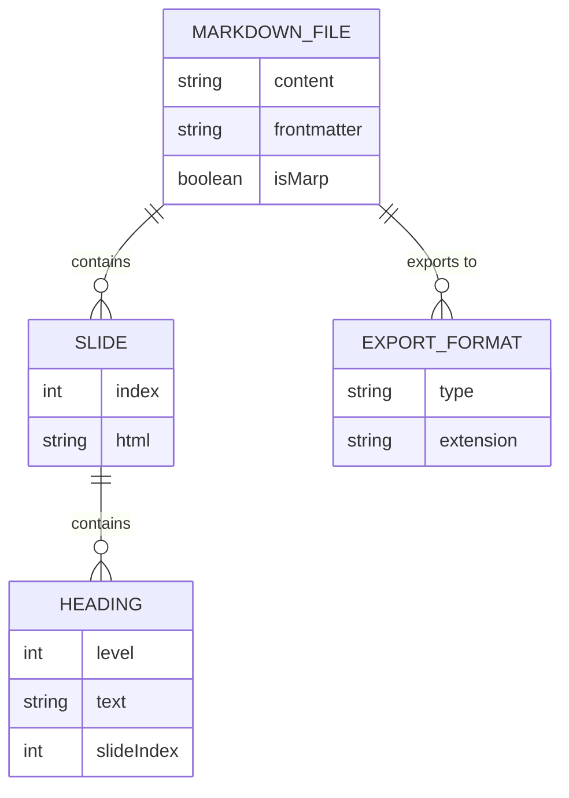
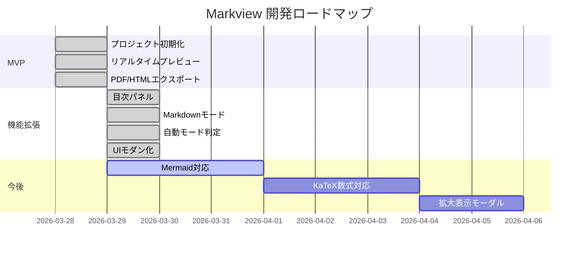
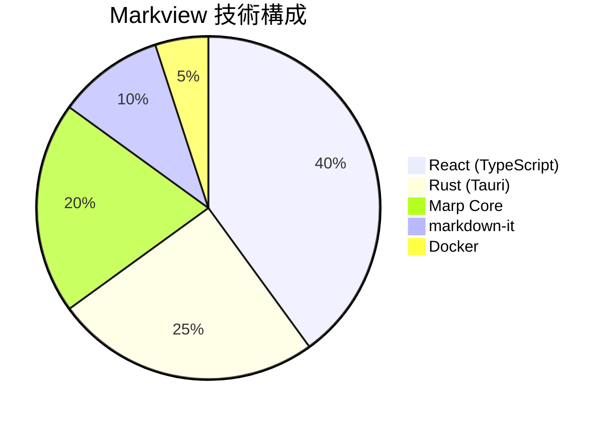

# Mermaid ダイアグラム サンプル

## フローチャート

```mermaid
flowchart TD
    A[Markdownファイル] --> B{marp: true?}
    B -->|Yes| C[Marp レンダリング]
    B -->|No| D[Markdown レンダリング]
    C --> E[スライドプレビュー]
    D --> F[ドキュメントプレビュー]
    E --> G[エクスポート]
    F --> G
    G --> H[PDF / HTML / PPTX / PNG]
```

## シーケンス図

```mermaid
sequenceDiagram
    participant U as ユーザー
    participant F as フロントエンド
    participant M as Marp Core
    participant R as Rust バックエンド
    participant C as Marp CLI

    U->>F: Markdown 入力
    F->>M: render(markdown)
    M-->>F: { html, css }
    F-->>U: プレビュー表示

    U->>F: エクスポートボタン
    F->>R: invoke("export_marp")
    R->>C: npx marp --pdf
    C-->>R: PDF ファイル
    R-->>F: 完了通知
    F-->>U: 保存完了
```

## クラス図

```mermaid
classDiagram
    class App {
        -markdown: string
        -mode: RenderMode
        -viewTab: ViewTab
        +handleFileImport()
    }
    class Editor {
        -value: string
        +onChange()
    }
    class Preview {
        -html: string
        -css: string
        +scrollToSlide()
    }
    class Toolbar {
        +handleOpenFile()
        +handleExport()
    }
    class Toc {
        -entries: TocEntry[]
        +onEntryClick()
    }

    App --> Editor
    App --> Preview
    App --> Toolbar
    App --> Toc
```

## 状態遷移図

```mermaid
stateDiagram-v2
    [*] --> 空エディタ
    空エディタ --> 編集中: テキスト入力
    空エディタ --> プレビュー: ファイルインポート

    編集中 --> Markdown判定: 内容変更
    Markdown判定 --> Marpモード: marp:true あり
    Markdown判定 --> Markdownモード: marp:true なし

    Marpモード --> プレビュー: プレビュータブ
    Markdownモード --> プレビュー: プレビュータブ

    プレビュー --> 編集中: 編集タブ
    プレビュー --> エクスポート: エクスポート実行
    エクスポート --> プレビュー: 完了
```

## ER図

```mermaid
erDiagram
    MARKDOWN_FILE ||--o{ SLIDE : contains
    MARKDOWN_FILE {
        string content
        string frontmatter
        boolean isMarp
    }
    SLIDE {
        int index
        string html
    }
    SLIDE ||--o{ HEADING : contains
    HEADING {
        int level
        string text
        int slideIndex
    }
    EXPORT_FORMAT {
        string type
        string extension
    }
    MARKDOWN_FILE ||--o{ EXPORT_FORMAT : "exports to"
```

## ガントチャート

```mermaid
gantt
    title Markview 開発ロードマップ
    dateFormat YYYY-MM-DD
    section MVP
        プロジェクト初期化       :done, 2026-03-28, 1d
        リアルタイムプレビュー   :done, 2026-03-28, 1d
        PDF/HTMLエクスポート     :done, 2026-03-28, 1d
    section 機能拡張
        目次パネル              :done, 2026-03-29, 1d
        Markdownモード          :done, 2026-03-29, 1d
        自動モード判定          :done, 2026-03-29, 1d
        UIモダン化              :done, 2026-03-29, 1d
    section 今後
        Mermaid対応             :active, 2026-03-29, 3d
        KaTeX数式対応           :2026-04-01, 3d
        拡大表示モーダル        :2026-04-04, 2d
```

## 円グラフ

```mermaid
pie title Markview 技術構成
    "React (TypeScript)" : 40
    "Rust (Tauri)" : 25
    "Marp Core" : 20
    "markdown-it" : 10
    "Docker" : 5
```
